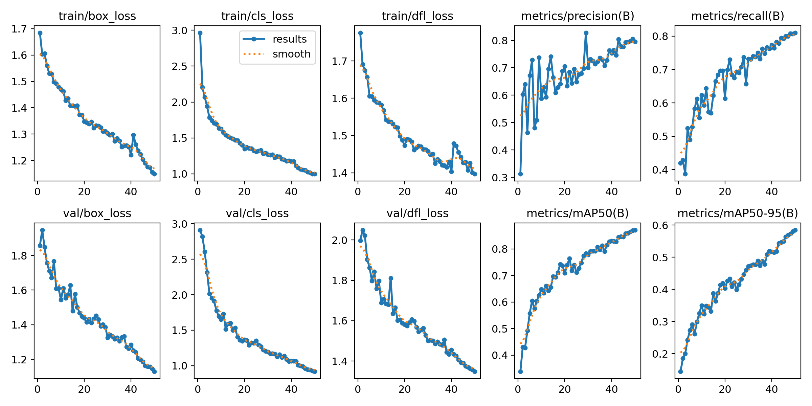
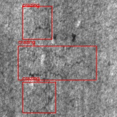
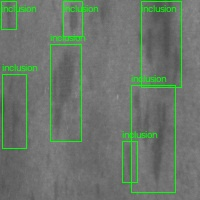
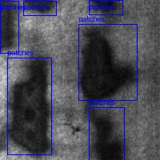
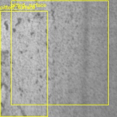
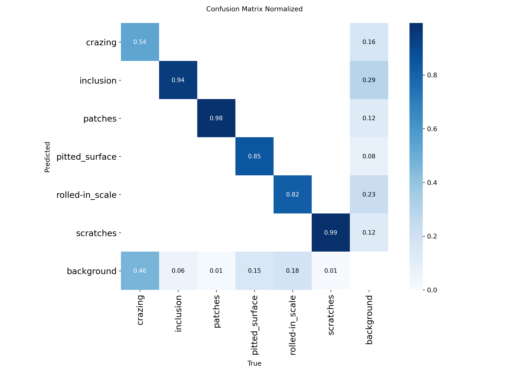
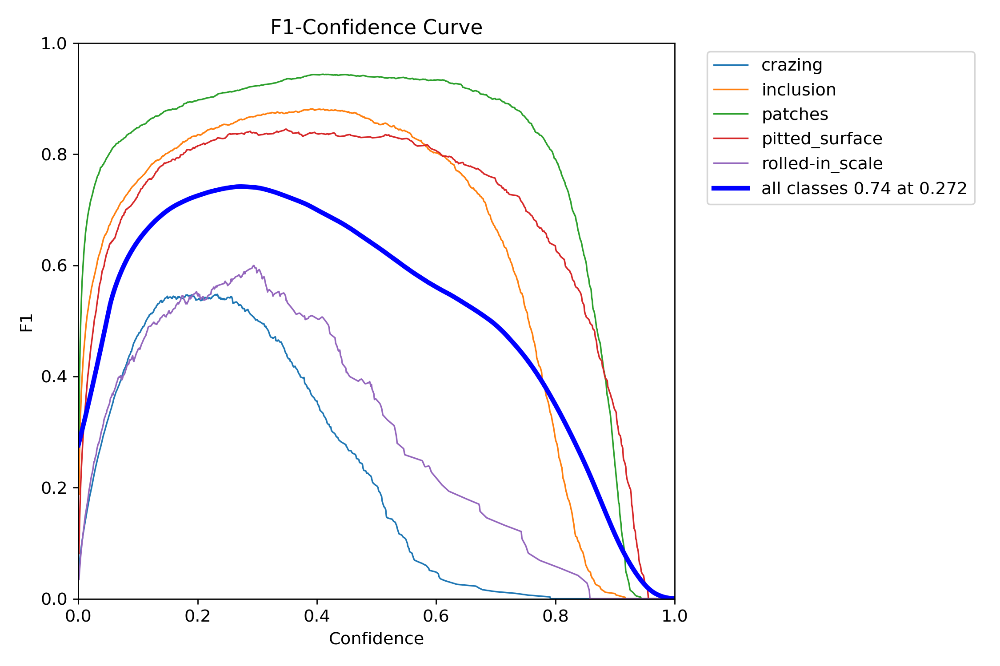
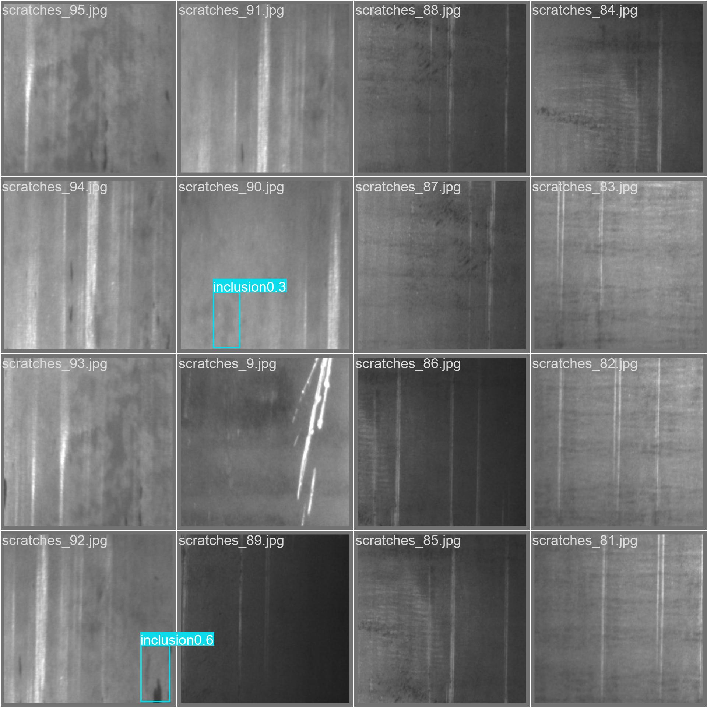

# NEU-DET 钢材表面缺陷检测（YOLOv8）

基于 **YOLOv8n** 的热轧带钢表面缺陷检测项目，在公开数据集 **NEU-DET** 上完成 6 类缺陷的检测训练与推理。

`mAP@50 = 0.808` · `mAP@50-95 = 0.539` · 50 epochs · 单卡 RTX 4060 训练约 54 分钟



---

## 1. 项目背景

热轧带钢在轧制过程中会产生裂纹、夹杂、划痕等多种表面缺陷。传统人工目检存在**效率低、标准不统一、易疲劳漏检**的问题，且难以在高速产线上实时完成。

本项目以工业质检为应用场景，验证「轻量级检测模型 + 通用公开数据集」这一技术路线的可行性：

- 用最小的 `yolov8n`（约 3.2M 参数）验证精度与推理速度的平衡点
- 全流程跑通「数据准备 → 训练 → 评估 → 推理可视化」，可直接迁移到自有产线数据

## 2. 数据集

**NEU-DET**（Northeastern University Surface Defect Database），东北大学发布的钢材表面缺陷公开数据集。

- 原始规模：1800 张 200×200 灰度图，6 类缺陷各 300 张，含 Pascal VOC 格式标注
- 本项目使用：**1620 张**（6 类各 270 张）
- 标注框总数：**3738** 个
- 数据划分：训练/验证共用同一目录，由 Ultralytics 自动切分 20% 作为验证集
- 标注来源：官方 Pascal VOC 标注转换而来（详见第 6 节「标注修复记录」）

| ID | 英文名 | 中文名 | 缺陷特征 |
|:--:|---|---|---|
| 0 | crazing | 裂纹 | 表面网状细小开裂 |
| 1 | inclusion | 夹杂 | 非金属夹杂物压入 |
| 2 | patches | 斑块 | 大面积片状色差 |
| 3 | pitted_surface | 点蚀表面 | 密集麻点状凹坑 |
| 4 | rolled-in_scale | 氧化铁皮压入 | 轧制氧化皮压入基体 |
| 5 | scratches | 划痕 | 机械划伤条纹 |

> 数据集不含原始图片，仓库中仅保留部分样例用于展示。获取方式见下文「关于数据集」。
> 本数据集共 6 类，原图中有少量同时含两类缺陷的样本（如 crazing + patches），这是官方标注本身的设定，非标注错误。

### 标注样例

| crazing（裂纹） | inclusion（夹杂） |
|---|---|
|  |  |

| patches（斑块） | pitted_surface（点蚀表面） |
|---|---|
|  |  |

## 3. 实验结果

### 整体指标（第 50 轮，验证集）

| 指标 | 数值 |
|---|---|
| Precision | 0.756 |
| Recall | 0.747 |
| **mAP@50** | **0.808** |
| mAP@50-95 | 0.539 |
| 训练轮数 | 50（patience=10 早停未触发） |
| 训练耗时 | 3218 s（约 54 分钟） |
| 单轮平均耗时 | 约 64 s |

### 混淆矩阵与 F1 曲线

| 归一化混淆矩阵 | F1-Confidence 曲线 |
|---|---|
|  |  |

### 验证集预测结果



## 4. 环境与依赖

| 项目 | 版本 / 配置 |
|---|---|
| 操作系统 | Windows 10 (19045) |
| Python | 3.10.21（conda 环境 `cv`） |
| 深度学习框架 | PyTorch 2.13.0 + CUDA 12.6 |
| 检测框架 | Ultralytics 8.4.137 |
| GPU | NVIDIA GeForce RTX 4060 8GB（驱动 560.94） |
| 图像处理 | OpenCV 5.0.0 |

```bash
conda create -n cv python=3.10 -y
conda activate cv
pip install -r requirements.txt
```

## 5. 快速开始

### 5.1 准备数据集

目录结构需整理为：

```
yolo_train/
├── data.yaml
├── dataset/
│   └── NEU-DET/
│       └── train/
│           ├── images/     # 1620 张 .jpg
│           └── labels/     # 对应的 YOLO 格式 .txt
```

标注为 YOLO 格式，每行 `类别ID 中心x 中心y 宽 高`（归一化到 0~1）。若原始标注为 Pascal VOC 的 XML，需要先做格式转换。

### 5.2 训练

```bash
python train.py
```

关键参数（见 `train.py`）：

```python
model.train(
    data=str(ROOT / "data.yaml"),   # ROOT = 本文件所在目录
    epochs=50,        # 训练轮数
    imgsz=640,        # 输入尺寸（原图 200x200 会上采样到 640）
    batch=16,         # 批大小，8GB 显存可上调至 32
    device=0,         # 使用第 0 号 GPU
    workers=4,
    patience=10,      # 早停耐心值
    amp=False,        # 关闭 AMP 以跳过兼容性检查
)
```

训练日志、曲线图与权重输出到 `runs/yolov8n_neu_det/`：
- `weights/best.pt` —— 验证集最优权重
- `weights/last.pt` —— 最后一轮权重
- `results.csv` —— 逐轮指标明细
- `results.png` / `confusion_matrix.png` / `BoxF1_curve.png` —— 可视化结果

### 5.3 推理

```bash
python predict.py
```

`predict.py` 中的 `SOURCE` 支持单张图片路径或整个文件夹，结果图保存到 `runs/detect/predict/`，并在终端打印每张图检出的缺陷类别与置信度（类别名自动转为中文）。

### 5.4 标注可视化

```bash
python view_labels.py
```

随机抽取各类别样本，把原始标注框画到图上输出到 `labels_view/`，用于快速检查标注质量。**这个脚本同时也是校验标注完整性的有效手段**——标注缺失的图片画出来会是空白。

## 6. 标注修复记录

本项目第一版训练使用的 YOLO 标注存在**大比例缺失**，导致模型实际没有学到全部 6 类。核查后发现并用官方原始标注修复。

### 问题

| 类别 | 修复前 | 具体情况 |
|---|---|---|
| `scratches` | **0 个框 / 0 张** | 270 张 scratches 图片完全没有对应标注文件，该类等价未被学习 |
| `rolled-in_scale` | 140 个框 / **70 张** | 270 张图中仅 70 张有标注 |
| 重复框 | 3 个文件 | `crazing_120`、`inclusion_62`、`patches_198` 各存在 1 个重复标注框 |

合计 **470 张图片无标注文件（占 29%）**，Ultralytics 会将无标注图片当作纯背景图处理，产生错误的负样本监督信号。

> 说明：核查初期曾怀疑存在「类别 ID 错位」（约 62 个文件的标注类别与文件名不符）。后经与官方 XML 逐张比对证实——**这类样本在原图中确实同时包含两类缺陷**，属于官方标注的正常设定，并非错误。此处记录以免误解。

### 修复方式

从不含缺失的完整官方 Pascal VOC 标注重新生成全部 YOLO 标注，并做三方交叉验证：

| 比对对象 | 一致率 |
|---|---|
| 数据源自带 YOLO 标签 vs 官方 XML | **1797 / 1797 = 100%**（验证转换公式与类别映射正确） |
| 本项目旧标注 vs 官方 XML | 1146 / 1149 = 99.74%（不一致的 3 张即重复框问题） |
| **修复后标注 vs 官方 XML** | **1618 / 1618 = 100%** |

### 修复后

| 类别 | 修复前（框数 / 涉及图片） | 修复后（框数 / 涉及图片） |
|---|---|---|
| crazing | 610 / 270 | 609 / 270 |
| inclusion | 852 / 300 | 921 / 348 |
| patches | 781 / 302 | 781 / 303 |
| pitted_surface | 385 / 270 | 386 / 271 |
| rolled-in_scale | **140 / 70** | **559 / 270** |
| scratches | **0 / 0** | **482 / 269** |
| **合计** | **2768** | **3738** |

最终 1620 张图中 **1619 张有标注**，仅 `scratches_247` 因原始发布包中缺失对应 XML 而保留为背景图。

## 7. 项目结构

```
yolo_train/
├── data.yaml                  # 数据集配置（路径、类别数、类别名）
├── train.py                   # 训练脚本
├── predict.py                 # 推理脚本（终端输出中文类别名）
├── view_labels.py             # 标注可视化 / 标注完整性检查
├── requirements.txt           # 依赖清单
├── docs/                      # README 展示用图
│   └── samples/               # 标注样例图
├── (dataset/)                 # 数据集，不入库
└── (runs/)                    # 训练输出，不入库
```

## 8. 工程细节记录

- **Windows 多进程保护**：Windows 下 DataLoader 多进程必须把入口包在 `main()` 中并用 `if __name__ == "__main__"` 保护，否则报 `An attempt has been made to start a new process before the current process has finished its bootstrapping phase`。
- **显存控制**：`yolov8n` + `batch=16` + `imgsz=640` 在 8GB 显存下占用平稳，batch 可上调至 32。
- **AMP 兼容性**：新版 Ultralytics 默认启用 AMP，首次运行会额外下载模型做兼容性检查，本项目关闭 `amp` 以避免多余下载。
- **中文类别输出**：`predict.py` 中通过 `CLASS_CN` 字典做英文到中文的映射；注意 `boxes.cls` 中是 GPU 张量，必须先 `int()` 转换后才能作字典键。

## 9. 关于数据集

NEU-DET 由东北大学发布，可公开获取，常见下载渠道包括 Kaggle（搜索 `NEU surface defect database`）及各类高校镜像。请遵守原始数据集的使用许可。

本仓库不包含数据集原始图片与训练好的权重文件，以保证仓库轻量。如需权重可自行训练生成，或联系作者。

## 10. 许可

本项目代码仅供学习与研究使用。Ultralytics YOLOv8 采用 AGPL-3.0 许可，商业使用请遵循其条款。
